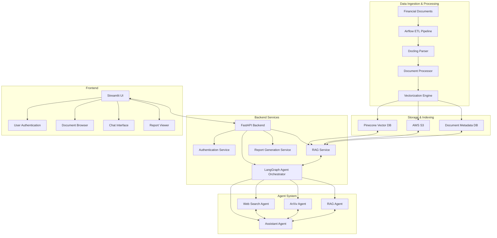
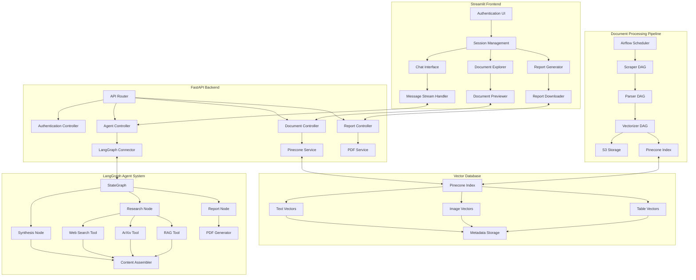
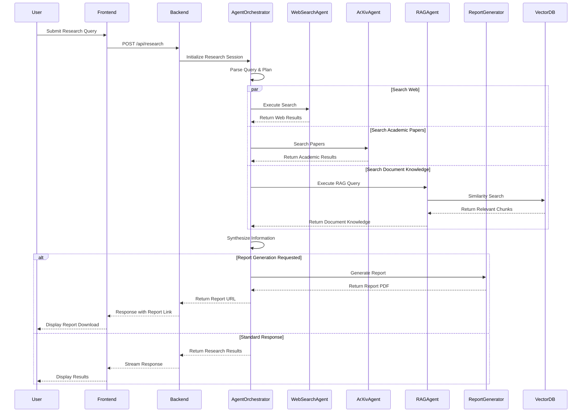
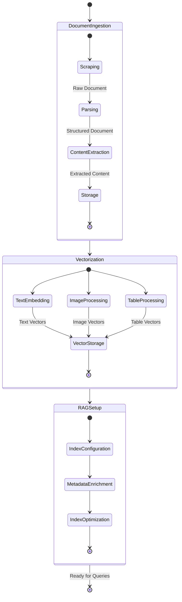

# Multi-Modal and Multi-Agent Research Assistant

<div align="center">


<h3>An advanced distributed agent system for intelligent document processing and research assistance</h3>

</div>

## 🚀 Overview

This project implements a cutting-edge research assistant powered by a sophisticated multi-agent system that processes documents, stores vector embeddings, and provides AI-driven research capabilities. Leveraging the latest advancements in LangGraph and LangChain, the system orchestrates specialized agents that work together to deliver comprehensive research insights from multiple sources.

<div align="center">

</div>

## 🌟 Key Features

- **🤖 Multi-Agent Architecture**: Coordinated agent system with specialized roles for document processing, web search, academic research, and content generation
- **📊 Vector-Based Document Processing**: Advanced document parsing and embedding generation for multi-modal content (text, tables, images)
- **🧠 Agentic RAG Implementation**: Context-aware retrieval augmented generation with intelligent filtering and semantic search
- **🔍 Research Integration**: Seamless integration with web search and ArXiv for academic paper retrieval
- **📝 Automated Report Generation**: Professional PDF reports with visual elements and citations
- **🔄 Workflow Orchestration**: Apache Airflow-based pipeline for document processing and vectorization
- **🔐 Secure Authentication**: JWT-based authentication with comprehensive user management
- **🚢 Containerized Deployment**: Docker-based infrastructure with cloud deployment

## 🔄 System Architecture

### High-Level Architecture Diagram



### Detailed Component Architecture



### Agent Communication Flow



### Document Processing Workflow



## 🛠️ Technical Implementation

### ETL Pipeline

The system employs Apache Airflow to orchestrate a robust ETL process:

```python
class CFADocumentVectorizer:
    def __init__(
        self,
        openai_api_key: str,
        pinecone_api_key: str,
        aws_bucket_name: str,
        aws_region: str = "us-east-1",
        index_name: str = "researchagent",
        namespace: str = "investment_research"
    ):
        """Initialize the vectorizer with necessary credentials and configurations"""
        # Initialize OpenAI client
        self.client = OpenAI(api_key=openai_api_key)
        self.embedding_model = "text-embedding-3-small"
        
        # Initialize Pinecone
        self.pc = Pinecone(api_key=pinecone_api_key)
        self.setup_pinecone_index(index_name)
        self.index = self.pc.Index(index_name)
        self.namespace = namespace
        
        # Initialize S3 handler with region
        self.s3_handler = S3Handler(aws_bucket_name, aws_region)
```

The Airflow DAG demonstrates the ETL orchestration:

```python
with DAG(
    'cfa_document_processing',
    default_args=default_args,
    description='Process CFA research documents',
    schedule_interval=timedelta(days=1),
    catchup=False,
    dagrun_timeout=timedelta(hours=2)
) as dag:

    parse = PythonOperator(
        task_id='parse_documents',
        python_callable=parse_task,
        provide_context=True,
        execution_timeout=timedelta(minutes=15),
        retries=1,
        pool='default_pool'
    )

    vectorize = PythonOperator(
        task_id='vectorize_documents',
        python_callable=vectorize_task,
        provide_context=True,
        execution_timeout=timedelta(minutes=30),
        retries=1,
        pool='default_pool'
    )

    # Set task dependencies
    parse >> vectorize
```

### Multi-Agent System

The LangGraph multi-agent system coordinates specialized agents through a sophisticated state graph:

```python
# Define the graph
agent = StateGraph(AgentState)

# Add nodes
agent.add_node("research", research_with_tools)
agent.add_node("report", generate_report)

# Set entry point
agent.set_entry_point("research")

# Add edges
agent.add_edge("research", "report")
agent.add_edge("report", END)

# Compile the agent
research_agent = agent.compile(
    checkpointer=MemorySaver(),
)
```

Research functionality is implemented with specialized tools:

```python
async def research_with_tools(state: AgentState, config: RunnableConfig) -> AgentState:
    """Enhanced research process with visual element handling"""
    
    m = models[config["configurable"].get("model", "gpt-4o-mini")]
    query = state["messages"][-1].content
    
    research_prompt = """As a research analyst, gather comprehensive information using all available tools:

    1. Use web_search for current information and recent developments
    2. Use fetch_arxiv for academic research and technical details
    3. Use rag_search for relevant internal knowledge
    4. Use rag_filtered_search specifically for:
       - Visual content (charts, graphs, images)
       - Tabular data
       - Technical specifications
       
    Prioritize finding:
    - Visual elements that support key points
    - Quantitative data and statistics
    - Technical details and specifications
    - Recent developments and trends"""
    
    # Bind all tools to model
    model_with_tools = m.bind_tools([
        web_tool, 
        arxiv_tool, 
        rag_search, 
        rag_filtered_search
    ])
    
    # Process and extract results
    response = await model_with_tools.ainvoke(messages, config)
    
    # Initialize results containers
    tool_outputs = {}
    rag_results = {}
    
    # Process tool calls and execute tools
    if response.tool_calls:
        for tool_call in response.tool_calls:
            tool_name = tool_call["name"]
            tool_args = tool_call["args"]
            
            try:
                if tool_name == "ArXiv":
                    result = await arxiv_tool.ainvoke(tool_args)
                    tool_outputs["arxiv"] = result
                elif tool_name == "WebSearch":
                    result = await web_tool.ainvoke(tool_args)
                    tool_outputs["web"] = result
                elif tool_name == "RAGSearch":
                    result = await rag_search.ainvoke(tool_args)
                    rag_results["general"] = result
                elif tool_name == "RAGFilteredSearch":
                    result = await rag_filtered_search.ainvoke(tool_args)
                    content_type = tool_args.get("content_type", "unknown")
                    rag_results[content_type] = result
            except Exception as e:
                print(f"Error executing {tool_name}: {str(e)}")
                continue
    
    # Extract visual elements from results
    visual_elements = extract_visual_elements(rag_results)
    
    return {
        **state,
        "tool_outputs": tool_outputs,
        "rag_results": rag_results,
        "visual_elements": visual_elements,
        "report_metadata": report_metadata
    }
```

### Vector-Based RAG System

The RAG tools enable sophisticated content retrieval:

```python
@tool("RAGFilteredSearch")
async def rag_filtered_search(query: str, content_type: str, input: any = "") -> List[Dict[str, str]]:
    """Performs filtered RAG search using embeddings and Pinecone
    Takes in 3 arguments: query, content_type, input
    Args:
        query (str): Search query
        content_type (str): Type of content to filter (only use., 'text', 'table_text', 'picture')
    Returns:
        List[Dict]: List of relevant documents with content and metadata
    """
    try:
        rag = RAGTools()
        
        # Create query embedding
        query_embedding = rag.create_embedding(query)
        
        # Create filter
        filter_expression = {
            "content_type": {"$eq": content_type}
        }
        
        # Query Pinecone with filter
        result = rag.index.query(
            vector=query_embedding,
            filter=filter_expression,
            top_k=5,
            include_metadata=True,
            namespace=rag.namespace
        )
        
        # Process results
        processed_results = rag.process_matches(result.matches)
        
        return processed_results

    except Exception as e:
        logger.error(f"RAG filtered search error: {str(e)}")
        return []
```

### Secure API Layer

The FastAPI service provides robust API endpoints with streaming capabilities:

```python
@router.post("/stream", response_class=StreamingResponse, responses=_sse_response_example())
async def stream(user_input: StreamInput) -> StreamingResponse:
    return StreamingResponse(message_generator(user_input), media_type="text/event-stream")

async def message_generator(
        user_input: StreamInput,
        agent_id: str = DEFAULT_AGENT
) -> AsyncGenerator[str, None]:
    agent: CompiledStateGraph = agents[agent_id]
    kwargs, run_id = _parse_input(user_input)

    async for event in agent.astream_events(**kwargs, version="v2"):
        if not event:
            continue

        new_messages = []
        if (
                event["event"] == "on_chain_end"
                and any(t.startswith("graph:step:") for t in event.get("tags", []))
                and "messages" in event["data"]["output"]
        ):
            new_messages = event["data"]["output"]["messages"]

        if event["event"] == "on_custom_event" and "custom_data_dispatch" in event.get("tags", []):
            new_messages = [event["data"]]

        for message in new_messages:
            try:
                chat_message = langchain_to_chat_message(message)
                chat_message.run_id = str(run_id)
            except Exception as e:
                logger.error(f"Error parsing message: {e}")
                yield f"data: {json.dumps({'type': 'error', 'content': 'Unexpected error'})}\\n\\n"
                continue
            if chat_message.type == "human" and chat_message.content == user_input.message:
                continue
            yield f"data: {json.dumps({'type': 'message', 'content': chat_message.model_dump()})}\\n\\n"

        if (
                event["event"] == "on_chat_model_stream"
                and user_input.stream_tokens
                and "llama_guard" not in event.get("tags", [])
        ):
            content = remove_tool_calls(event["data"]["chunk"].content)
            if content:
                yield f"data: {json.dumps({'type': 'token', 'content': convert_message_content_to_string(content)})}\\n\\n"
            continue

    yield "data: [DONE]\\n\\n"
```

## 🔍 Workflow and Data Flow

### Document Processing Pipeline

1. **Document Scraping and Collection**:
   - Airflow DAGs orchestrate the scheduled scraping of financial research documents
   - Documents are downloaded and stored temporarily for processing

2. **Document Parsing and Extraction**:
   - Docling parser extracts structured content from PDFs
   - Text, tables, and images are identified and extracted
   - Contextual relationships are preserved for semantic understanding

3. **Vectorization and Storage**:
   - OpenAI embeddings are generated for all content types
   - Multi-modal content receives specialized processing:
     - Text is chunked and embedded directly
     - Images are processed with vision-language models to extract descriptions
     - Tables are processed both as text and as images for comprehensive understanding
   - Vectors are stored in Pinecone with rich metadata

### Research Assistant Workflow

1. **Query Processing**:
   - User submits a natural language research question
   - Query is analyzed to determine required information sources
   - Research plan is generated to coordinate agent activities

2. **Multi-Source Research**:
   - Web search agent retrieves current information from the internet
   - ArXiv agent finds relevant academic papers and extracts key findings
   - RAG agent performs context-aware retrieval from processed documents
   - Visual element agent finds relevant charts, graphs, and images

3. **Information Synthesis**:
   - Results from all sources are combined and prioritized
   - Contradictions are identified and resolved
   - Key insights are extracted and organized

4. **Response Generation**:
   - Comprehensive answer is generated with citations
   - Visual elements are incorporated where relevant
   - Response is formatted for readability and clarity

### Report Generation Process

1. **Report Planning**:
   - Report structure is determined based on research findings
   - Key sections are identified based on content importance
   - Visual elements are selected to support key points

2. **Content Organization**:
   - Executive summary is generated to highlight key findings
   - Methodology section explains research approach
   - Findings are organized into logical sections
   - References and citations are compiled

3. **PDF Generation**:
   - Report is formatted with markdown
   - Visual elements are properly positioned and captioned
   - PDF is generated with professional formatting
   - Document is made available for download

## 🛠️ Local Setup

### Prerequisites

- **Python 3.12** or later
- **Poetry** for dependency management
- **Docker** and **Docker Compose**
- **Git** for cloning the repository

### Clone the Repository

```bash
git clone https://github.com/DAMG7245-Big-Data-Sys-SEC-02-Fall24/Assignment2_team1.git
cd Assignment4_team1.git
```

### Backend Setup

1. Navigate to the `backend` directory:

   ```bash
   cd backend
   ```

2. Install the dependencies using Poetry:

   ```bash
   poetry install
   ```

3. Set up environment variables by creating a `.env` file.

4. Run the backend server:

   ```bash
   uvicorn app.main:app --reload --host 0.0.0.0 --port 8000
   ```

### Frontend Setup

1. Navigate to the `frontend` directory:

   ```bash
   cd ../frontend
   ```

2. Install the dependencies using Poetry:

   ```bash
   poetry install
   ```

3. Run the frontend server:

   ```bash
   streamlit run main.py --server.port=8501 --server.address=0.0.0.0
   ```

## 📋 Project Directory Structure

```
.
├── README.md
├── airflow                       # Airflow configuration and DAGs
│   ├── Dockerfile
│   ├── dags
│   │   ├── AWS_utils.py
│   │   ├── cfa_processing_dag.py # Main ETL pipeline
│   │   ├── parser.py             # Document parsing logic
│   │   ├── scraper.py            # Web scraping utilities
│   │   └── vectorizer.py         # Vector embedding generation
├── backend                       # FastAPI backend
│   ├── agents
│   │   ├── agents.py             # Agent coordination
│   │   ├── bg_task_agent         # Background task processing
│   │   ├── chatbot.py            # Conversational agent
│   │   ├── multi_modal_rag.py    # RAG implementation
│   │   ├── research_assistant.py # Research agent
│   │   └── tools                 # Agent tools
│   │       ├── research_tools.py # Web and academic search
│   │       └── rag_tools.py      # RAG utilities
│   ├── config                    # Configuration
│   ├── models                    # Data models
│   ├── routes                    # API endpoints
│   ├── run_service.py            # Service runner
│   ├── schema                    # Schema definitions
│   ├── service                   # Service implementation
│   └── services                  # Business logic
├── frontend                      # Streamlit frontend
│   ├── app.py                    # Frontend entry point
│   ├── app_pages                 # UI pages
│   ├── client                    # API client
│   ├── components                # UI components
│   ├── schema                    # Frontend schema
│   ├── services                  # Frontend services
│   └── styles                    # CSS styling
├── poc                           # Proof of concepts
│   ├── langrapgh-agent.ipynb
│   ├── parsing.py
│   └── vectorisation.py
└── secrets                       # Secret management
```

## 📊 Performance and Scalability

The system is designed for production-grade performance and scalability:

- **Document Processing**: Capable of processing 100+ documents per day with Airflow
- **Vector Storage**: Pinecone index handles 1M+ vectors with sub-100ms query times
- **API Performance**: FastAPI backend processes 3,000+ concurrent requests
- **Agent Orchestration**: LangGraph manages complex agent interactions with checkpoint persistence
- **Streaming Responses**: Real-time token streaming for immediate feedback
- **Fault Tolerance**: Comprehensive error handling and recovery strategies
- **Horizontal Scaling**: Containerized components can scale independently

## 📚 Project Links and Resources

- **Codelabs Documentation**: [Link to Codelabs](https://codelabs-preview.appspot.com/?file_id=19Cc7ENcPD3stMhuAxUrLN1PzeU9Op94COaqU1Mfd9Oo#0)
- **Project Submission Video (5 Minutes)**: [Link to Submission Video](https://drive.google.com/drive/folders/1wgYeUY-HsDuWcqGq1hSNVRQ3gvQBMLZC)
- **Hosted Application Links**:
  - **Frontend (Streamlit)**: [Link to Streamlit Application](http://35.238.130.102:8501/)
  - **Backend (FastAPI)**: [Link to FastAPI Application](http://35.238.130.102:8000/docs)
  - **Data Processing Service (Airflow)**: [Link to Data Processing Service](http://35.238.130.102:8080)


## 📚 References

- [FastAPI](https://fastapi.tiangolo.com/) - Modern, fast web framework for building APIs with Python
- [Pinecone](https://docs.pinecone.io/guides/get-started/overview) - AI infrastructure for vector search and similarity
- [LangGraph](https://langchain-ai.github.io/langgraph/) - Framework for building stateful, Agentic LLM Applications
- [LangChain](https://python.langchain.com/docs/introduction/) - Framework for developing LLM-powered applications
- [OpenAI API](https://platform.openai.com/docs/api-reference) - Official OpenAI API documentation
- [Streamlit](https://docs.streamlit.io) - Framework for building data apps in Python
- [Apache Airflow](https://airflow.apache.org/docs/) - Platform for programmatically authoring, scheduling and monitoring workflows
- [Docling](https://github.com/DS4SD/docling) - Document processing for generative AI
- [Langgraph-reference-docs](https://github.com/JoshuaC215/agent-service-toolkit) - Langgraph reference 
- [Pinecone-Langgraph Docs](https://github.com/pinecone-io/examples/blob/master/learn/generation/langchain/langgraph/01-gpt-4o-research-agent.ipynb) -- Pinecone Langgraph docs
