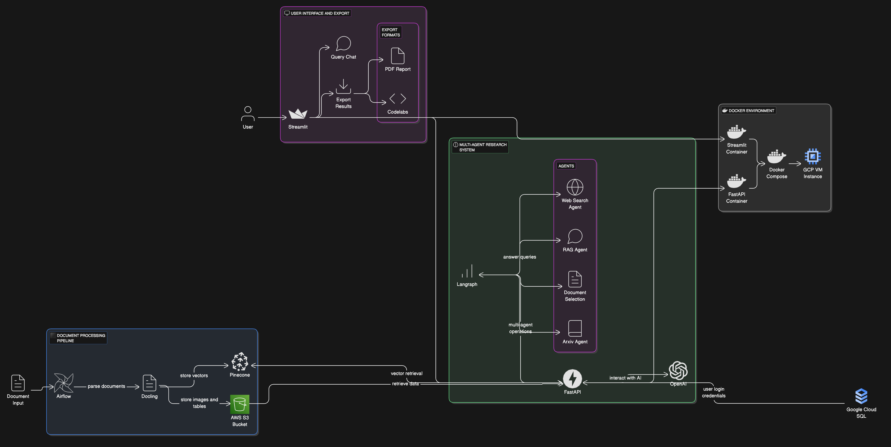

# Assignment4_team1

- **GitHub Issues and Tasks**: [Link to GitHub Project Issues](https://github.com/orgs/DAMG7245-Big-Data-Sys-SEC-02-Fall24/projects/5/views/1)
- **Codelabs Documentation**: [Link to Codelabs](https://codelabs-preview.appspot.com/?file_id=19Cc7ENcPD3stMhuAxUrLN1PzeU9Op94COaqU1Mfd9Oo#0)
- **Project Submission Video (5 Minutes)**: [Link to Submission Video](https://drive.google.com/drive/folders/1wgYeUY-HsDuWcqGq1hSNVRQ3gvQBMLZC)
- **Hosted Application Links**:
  - **Frontend (Streamlit)**: [Link to Streamlit Application](http://35.238.130.102:8501/)
  - **Backend (FastAPI)**: [Link to FastAPI Application](http://35.238.130.102:8000/docs)
  - **Data Processing Service (Airflow)**: [Link to Data Processing Service](http://35.238.130.102:8080)
# Research Tool with Airflow, Pinecone, and Langraph

## Overview

This project implements an end-to-end research tool that processes documents, stores vectors, and provides a multi-agent research interface. The system uses Airflow for pipeline automation, Pinecone for vector storage, and Langraph for multi-agent interactions.


## Features

- **Document Processing Pipeline**
  - Automated document parsing using Docling
  - Vector storage and retrieval with Pinecone
  - Airflow-based workflow automation

- **Multi-Agent Research System**
  - Document selection interface
  - Arxiv paper search integration
  - Web search capabilities
  - RAG-based query answering

- **Interactive Research Interface**
  - Question-answer system (5-6 questions per document)
  - Research session management
  - Professional PDF report generation
  - Codelabs-formatted documentation



## Project Structure

```
.
├── README.md
├── airflow
│   ├── Dockerfile
│   ├── dags
│   │   ├── AWS_utils.py
│   │   ├── __init__.py
│   │   ├── cfa_processing_dag.py
│   │   ├── parser.py
│   │   ├── scraper.py
│   │   └── vectorizer.py
│   ├── docker-compose.yaml
│   └── requirements.txt
├── backend
│   ├── __init__.py
│   ├── __pycache__
│   │   ├── __init__.cpython-312.pyc
│   │   └── run_service.cpython-312.pyc
│   ├── agents
│   │   ├── __init__.py
│   │   ├── __pycache__
│   │   │   ├── __init__.cpython-312.pyc
│   │   │   ├── agents.cpython-312.pyc
│   │   │   ├── chatbot.cpython-312.pyc
│   │   │   ├── llama_guard.cpython-312.pyc
│   │   │   ├── models.cpython-312.pyc
│   │   │   ├── research_assistant.cpython-312.pyc
│   │   │   ├── tools.cpython-312.pyc
│   │   │   └── utils.cpython-312.pyc
│   │   ├── agents.py
│   │   ├── bg_task_agent
│   │   │   ├── __init__.py
│   │   │   ├── __pycache__
│   │   │   │   ├── __init__.cpython-312.pyc
│   │   │   │   ├── bg_task_agent.cpython-312.pyc
│   │   │   │   └── task.cpython-312.pyc
│   │   │   ├── bg_task_agent.py
│   │   │   └── task.py
│   │   ├── chatbot.py
│   │   ├── llama_guard.py
│   │   ├── models.py
│   │   ├── research_assistant.py
│   │   ├── tools.py
│   │   └── utils.py
│   ├── client
│   │   ├── __init__.py
│   │   └── client.py
│   ├── config
│   │   ├── __init__.py
│   │   ├── __pycache__
│   │   │   ├── __init__.cpython-312.pyc
│   │   │   └── settings.cpython-312.pyc
│   │   └── settings.py
│   ├── controllers
│   │   ├── __init__.py
│   │   ├── __pycache__
│   │   │   ├── __init__.cpython-312.pyc
│   │   │   └── auth_controller.cpython-312.pyc
│   │   └── auth_controller.py
│   ├── models
│   │   ├── __init__.py
│   │   ├── __pycache__
│   │   │   ├── __init__.cpython-312.pyc
│   │   │   ├── publication.cpython-312.pyc
│   │   │   └── user_model.cpython-312.pyc
│   │   ├── publication.py
│   │   └── user_model.py
│   ├── routes
│   │   ├── __pycache__
│   │   │   ├── auth_routes.cpython-312.pyc
│   │   │   ├── helpers.cpython-312.pyc
│   │   │   ├── publications_routes.cpython-312.pyc
│   │   │   └── summary_routes.cpython-312.pyc
│   │   └── auth_routes.py
│   ├── run_agent.py
│   ├── run_client.py
│   ├── run_service.py
│   ├── schema
│   │   ├── __init__.py
│   │   ├── __pycache__
│   │   │   ├── __init__.cpython-312.pyc
│   │   │   ├── schema.cpython-312.pyc
│   │   │   └── task_data.cpython-312.pyc
│   │   ├── schema.py
│   │   └── task_data.py
│   ├── service
│   │   ├── __init__.py
│   │   ├── __pycache__
│   │   │   ├── __init__.cpython-312.pyc
│   │   │   ├── service.cpython-312.pyc
│   │   │   └── utils.cpython-312.pyc
│   │   ├── service.py
│   │   └── utils.py
│   └── services
│       ├── PublicationService.py
│       ├── __init__.py
│       ├── __pycache__
│       │   ├── PublicationService.cpython-312.pyc
│       │   ├── __init__.cpython-312.pyc
│       │   ├── auth_service.cpython-312.pyc
│       │   ├── database_service.cpython-312.pyc
│       │   ├── pinecone_service.cpython-312.pyc
│       │   ├── rag_service.cpython-312.pyc
│       │   └── snowflake.cpython-312.pyc
│       ├── auth_service.py
│       ├── database_service.py
│       ├── gpt.py
│       ├── object_store.py
│       ├── pinecone_service.py
│       ├── rag_service.py
│       ├── snowflake.py
│       ├── table_page_1_1.csv
│       └── tools.py
├── checkpoints.db
├── frontend
│   ├── app.py
│   ├── app_pages
│   │   ├── __init__.py
│   │   ├── __pycache__
│   │   │   ├── __init__.cpython-310.pyc
│   │   │   ├── document_actions_page.cpython-310.pyc
│   │   │   ├── documents_page.cpython-310.pyc
│   │   │   └── home_page.cpython-310.pyc
│   │   ├── document_actions_page.py
│   │   ├── documents_page.py
│   │   ├── home_page.py
│   │   └── pdf_gallery.py
│   ├── client
│   │   ├── __init__.py
│   │   ├── __pycache__
│   │   │   ├── __init__.cpython-310.pyc
│   │   │   └── client.cpython-310.pyc
│   │   └── client.py
│   ├── components
│   │   ├── __init__.py
│   │   ├── __pycache__
│   │   │   └── __init__.cpython-310.pyc
│   │   ├── navbar.py
│   │   ├── services
│   │   │   ├── __init__.py
│   │   │   ├── __pycache__
│   │   │   │   ├── __init__.cpython-310.pyc
│   │   │   │   └── pdf_viewer.cpython-310.pyc
│   │   │   ├── pdf_viewer.py
│   │   │   └── s3_service.py
│   │   └── ui
│   │       ├── __init__.py
│   │       ├── buttons.py
│   │       └── card.py
│   ├── data
│   │   └── users.db
│   ├── pyproject.toml
│   ├── schema
│   │   ├── __init__.py
│   │   ├── __pycache__
│   │   │   ├── __init__.cpython-310.pyc
│   │   │   ├── schema.cpython-310.pyc
│   │   │   └── task_data.cpython-310.pyc
│   │   ├── schema.py
│   │   └── task_data.py
│   ├── services
│   │   ├── __init__.py
│   │   ├── __pycache__
│   │   │   ├── __init__.cpython-310.pyc
│   │   │   ├── authentication.cpython-310.pyc
│   │   │   ├── session_store.cpython-310.pyc
│   │   │   └── utils.cpython-310.pyc
│   │   ├── authentication.py
│   │   ├── pdf_viewer.py
│   │   ├── session_store.py
│   │   └── utils.py
│   └── styles
│       └── styles.css
├── poc
│   ├── convert_requirements.py
│   ├── langrapgh-agent.ipynb
│   ├── langrapgh-agent.py
│   ├── parsing.py
│   ├── prop-2.ipynb
│   ├── scraper.ipynb
│   ├── scraper.py
│   └── vectorisation.py
├── poetry.lock
├── secrets
│   ├── gcp.json
│   ├── private_key.pem
│   └── public_key.pem
└── tree_structure.md
```
`

## Local Setup and Running the Project Locally

### Prerequisites

Ensure that the following dependencies are installed on your system:

- **Python 3.12** or later
- **Poetry** for dependency management
- **Docker** and **Docker Compose**
- **Git** for cloning the repository

### Clone the Repository

Clone the repository to your local machine:

```bash
git clone https://github.com/DAMG7245-Big-Data-Sys-SEC-02-Fall24/Assignment2_team1.git
cd Assignment4_team1.git
```

### Backend Setup

1. Navigate to the `backend` directory:

   ```bash
   cd backend
   ```

2. Install the dependencies using Poetry:

   ```bash
   poetry install
   ```

3. Set up environment variables by creating a `.env` file in the `backend` directory (refer to the **Environment Variables** section for more details).

4. Run the backend server:

   ```bash
   uvicorn app.main:app --reload --host 0.0.0.0 --port 8000
   ```

   The backend will be accessible at `http://localhost:8000`.

### Frontend Setup

1. Navigate to the `frontend` directory:

   ```bash
   cd ../frontend
   ```

2. Install the dependencies using Poetry:

   ```bash
   poetry install
   ```

3. Set up environment variables by creating a `.env` file in the `frontend` directory (refer to the **Environment Variables** section for more details).

4. Run the frontend server:

   ```bash
   streamlit run main.py --server.port=8501 --server.address=0.0.0.0
   ```

   The frontend will be accessible at `http://localhost:8501`.

### Running Both Services

To run the entire project locally:

1. Open two terminal windows or tabs.
2. In the first terminal, navigate to the `backend` directory and start the backend service.
3. In the second terminal, navigate to the `frontend` directory and start the frontend service.


# Workflow of each component

This research tool combines multiple services to create an end-to-end system for document processing, vector storage, and multi-agent research assistance. Each service has a specific role in the overall workflow, as described below.


## 1. Airflow - Document Processing Pipeline

**Purpose**: Airflow orchestrates the automated document processing pipeline, managing the workflow of parsing, vectorization, and storage in a systematic, error-resistant manner. This ensures the system can handle large volumes of documents without manual intervention.

**How it Works**:
- **DAGs (Directed Acyclic Graphs)**: Airflow uses DAGs to define the dependencies and execution order of tasks in the pipeline.
- **Data Ingestion and Preprocessing**: Tasks are designed to first scrape data from the source  and then parse these documents into manageable sections using Docling.
- **Vectorization**: After parsing, the documents are vectorized using language embeddings using OpenAI to create numeric representations that capture their semantic content.
- **Storage in Pinecone**: The vectorized data is then stored in Pinecone for fast and efficient similarity-based search during querying.

Each stage in the pipeline is automated, allowing new documents to be processed continuously. Airflow’s web interface also provides a way to monitor task success, failure, and logs, making it easy to troubleshoot issues.

---

## 2. FastAPI - Backend API

**Purpose**: FastAPI serves as the backend API layer, exposing endpoints to handle interactions between the frontend, Airflow, and the multi-agent system. It manages requests, orchestrates workflows, and facilitates communication with other components like Pinecone and Langraph.

**Key Features**:
- **RESTful API Endpoints**: FastAPI offers endpoints for various operations like document upload, retrieval, and querying, as well as endpoints for managing vectorized data and interacting with the research agents.
- **Authentication with JWT**: It handles user authentication using JWT (JSON Web Tokens), which secures endpoints to prevent unauthorized access and ensure data integrity.

**Interaction with Other Components**:
- **Pinecone**: FastAPI interacts with Pinecone to store and retrieve vectorized documents.
- **Airflow**: FastAPI triggers and monitors Airflow DAGs when new documents need to be processed or vectorized.
- **Langraph**: FastAPI communicates with Langraph’s multi-agent system to enable conversational and search functionalities in the research assistant interface.

---

## 3. Langraph - Multi-Agent System for Research Assistance

**Purpose**: Langraph manages a multi-agent research system that interacts with documents and provides contextual answers to user queries. It is particularly useful for research workflows, as it supports multiple agents with specialized roles.

**How it Works**:
- **Agent-Based Interactions**: Each agent in Langraph is designed with a specific purpose. For instance, there might be agents that focus on summarizing document content, answering questions, retrieving relevant research papers, or conducting web searches.
- **Agentic RAG Implementation **: Langraph uses Retrieval-Augmented Generation (RAG), which combines document retrieval from Pinecone with language model generation. This allows the system to generate context-aware, accurate answers based on the content of the documents.
- **Web Search and ArXiv Agent**: Langraph’s agent system enables multi-turn conversations with users, allowing them to refine their queries, ask follow-up questions, and explore different parts of the document. This simulates a research assistant like who can respond to complex questions and guide users in navigating through large document sets.

Langraph, therefore, allows the research tool to provide a rich, interactive experience, simulating a human-like research assistant that adapts based on user interactions and document context.

---

## 4. Streamlit - User Interface (UI)

**Purpose**: Streamlit provides an intuitive, interactive frontend interface for the research tool, allowing users to view documents, ask questions, and generate reports in a user-friendly way.

**Key Features**:
- **Document Selection and Viewing**: Users can browse and select documents for analysis. The document viewer supports navigation through sections or chapters, depending on the document structure.
- **Interactive Q&A**: Streamlit provides an input box where users can type questions about the selected document. The questions are processed via FastAPI and Langraph, and responses are displayed on the interface.
- **Report Generation**: Users can generate PDF reports that summarize research findings, interactions, and key insights from the document analysis. This feature is useful for academic or professional reporting.
- **Session Management**: Streamlit maintains session state, allowing users to ask multiple questions about a document without reloading it each time, and enabling them to save chat history as research notes.

**Interface Design**:
Streamlit’s components are designed for ease of use, with a clean layout that allows users to:
- Upload and view documents,
- Ask and refine queries,
- Generate professional reports, and
- Access analysis tools in a seamless workflow.

Streamlit enhances the tool's usability, enabling even non-technical users to benefit from the advanced document processing and multi-agent system.

---

## Workflow Summary

1. **Ingestion**: Airflow scrapes and parses documents.
2. **Vectorization**: Document embeddings are created and stored in Pinecone.
3. **Research Assistance**: FastAPI and Langraph handle queries, with Langraph agents providing detailed, context-aware responses.
4. **User Interaction**: Users interact with documents, ask questions, and generate reports via the Streamlit UI.

Each component plays a crucial role in creating a powerful research tool, combining automation, storage, multi-agent interaction, and user-friendly design for an efficient document analysis experience.


## Contributing

Team Members:

Uday Kiran Dasari - Airflow, Agents, Backend ,Docker - 33.3%
Sai Surya Madhav Rebbapragada - Agents, Backend, Frontend, Integratrion, Frontend - 33.3%
Akash Varun Pennamaraju - Agents, Backend , integration - 33.3%

## References
## Documentation Links

- [FastAPI](https://fastapi.tiangolo.com/) - Modern, fast web framework for building APIs with Python
- [Pinecone](https://docs.pinecone.io/guides/get-started/overview) - AI infrastructure for vector search and similarity
- [LangGraph](https://langchain-ai.github.io/langgraph/) - Framework for building stateful, Agentic LLM Applications
- [LangChain](https://python.langchain.com/docs/introduction/) - Framework for developing LLM-powered applications
- [OpenAI API](https://platform.openai.com/docs/api-reference) - Official OpenAI API documentation
- [Streamlit](https://docs.streamlit.io) - Framework for building data apps in Python
- [Apache Airflow](https://airflow.apache.org/docs/) - Platform for programmatically authoring, scheduling and monitoring workflows
- [Docling](https://github.com/DS4SD/docling) - Document processing for generative AI
- [Langgraph-reference-docs](https://github.com/JoshuaC215/agent-service-toolkit) - Langgraph reference 
- [Pinecone-Langgraph Docs](https://github.com/pinecone-io/examples/blob/master/learn/generation/langchain/langgraph/01-gpt-4o-research-agent.ipynb) -- Pinecone Langgraph docs 
  
